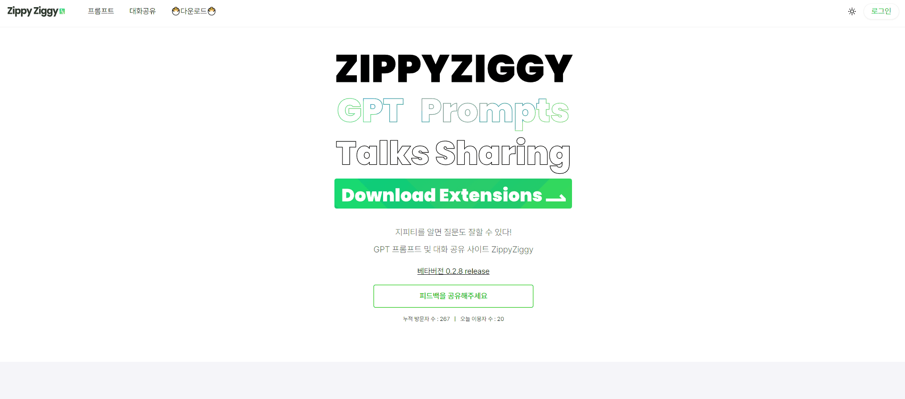
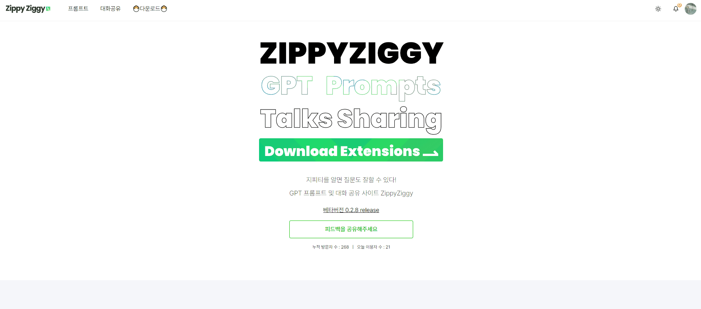
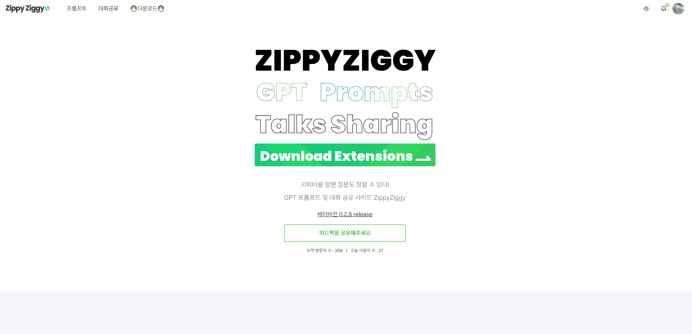
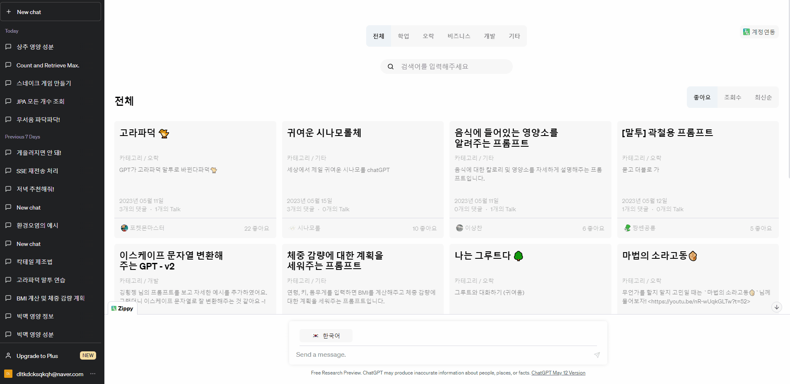
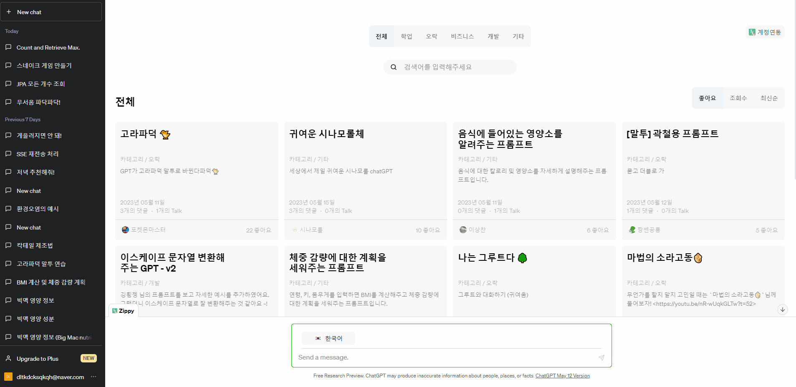
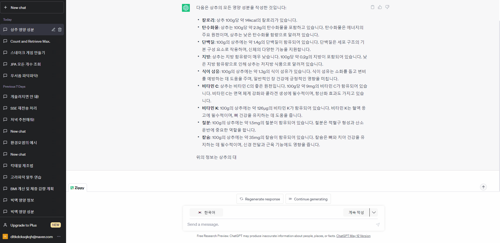
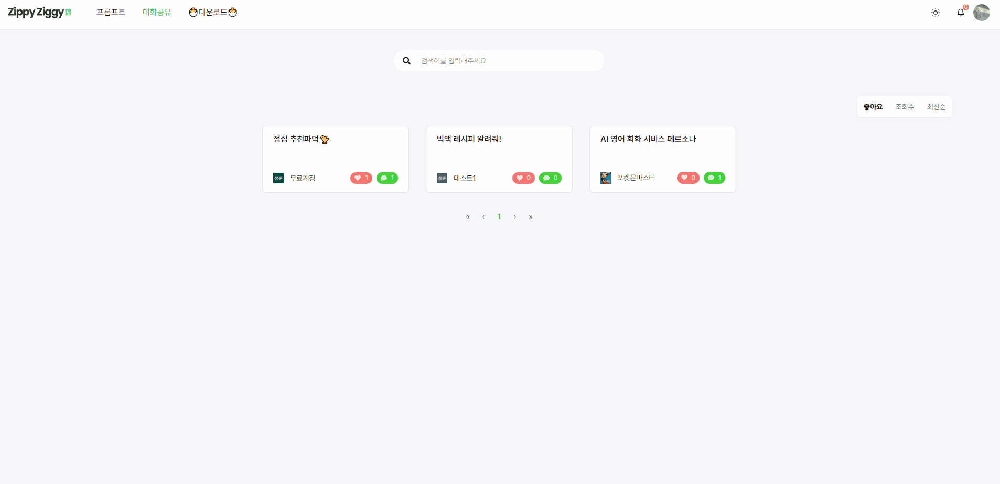
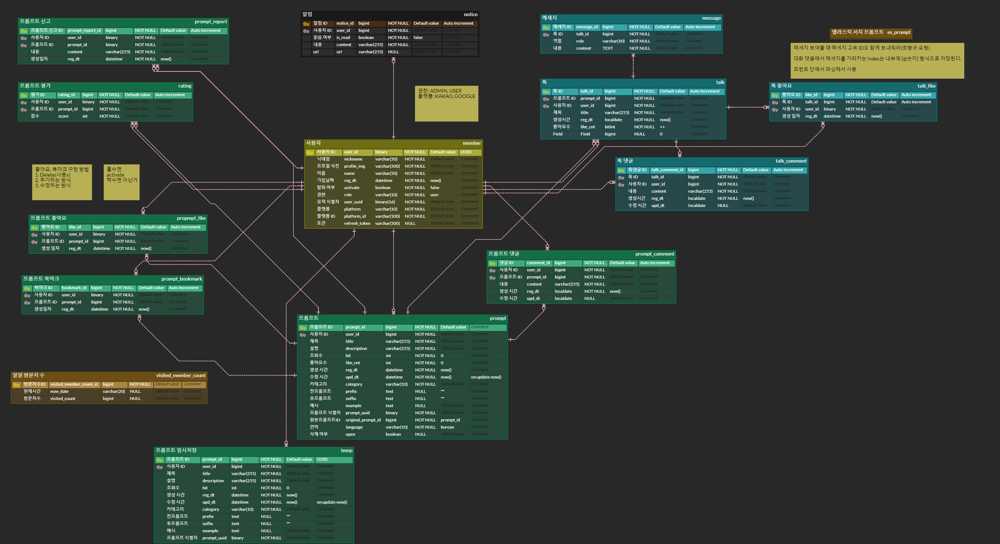

# ZippyZiggy

### - ChatGPT 프롬프트 제작 및 공유 플랫폼

## 목차

- ZippyZiggy

  - [목차](#목차)
  - [프로젝트 소개](#💻-프로젝트-소개)

  - [서비스 화면](#📌서비스-화면)
  - [와이어프레임](#⌨-와이어-프레임)
  - [ERD 다이어그램](#ERD-다이어그램)

  - [API 명세서](#API-명세서)

    

## 💻 프로젝트 소개

1. 개발 기간: 2023.04.10 ~ 2023.05.19 (총 6주)
2. 인원(총 6인)

<table>
  <tr>
   <td align="center"><a href="https://github.com/dltkdcks456">
    <b>이상찬</b> </a>
    <b>팀장, BE</b> </td>
   <td align="center"><a href="https://github.com/bbookng">
    <b>bbookng</b> </a>
   <b>BE</b> </td>
   <td align="center"><a href="https://github.com/EZ-000">
    <b>EZ-000</b> </a>
    <b>BE</b> </td>
   <td align="center"><a href="https://github.com/heisje">
    <b>heeje</b> </a>
   <b>FE</b> </td>
   <td align="center"><a href="https://github.com/ChangJuneKim">
    <b>김창준</b> </a>
       <b>FE</b> </td>
   <td align="center"><a href="https://github.com/Choihyoungkyu">
    <b>ChoiHyoungKyu</b> </a>
      <b>FE</b> </td>
  </tr>
</table>

3. 개요

-  서비스 목표: 간편하고 쉬운 프롬프트 제작을 통해 일반 사용자들에게 ChatGPT 접근성 향상
- 기획 배경
  - 사용자 접근성 향상
  - 프롬프트 제작에 대한 어려움
- 기대 효과
  - 튜토리얼을 통해 일반 사용자들도 손쉽게 배울 수 있는 기회 제공
  - ChatGPT의 활용을 통해 문서 작성, 질문 답변, 창의적 아이디어 도출 등의 작업 수행 가능
  - ChatGPT 학습 시간 단축

- 핵심 기능
  - OAuth를 통한 카카오/구글 로그인 기능
  - Elastic Search를 통한 빠르고 효율적인 검색 기능 제공
  - SSE (Server Sends Event)를 활용한 실시간 알림 기능
  - ChatGPT용 확장 프로그램 제공
  - 프롬프트 포크 기능
  - 브라우저 크기별 반응형 웹 페이지

## 📌서비스 화면

#### 메인 화면

: 확장 프로그램 다운로드 링크와 첫 방문자를 위한 튜토리얼이 제공됩니다. 간단한 예시들을 통해 효과적인 프롬프트 작성을 쉽게 확인하실 수 있습니다. 다른 사람들의 Chat GPT 대화를 살펴보러 가는 링크도 추가되어 있습니다.

### 로그인

: 카카오/구글 인증과 Spring Security + JWT를 활용하여 로그인 서비스를 구현하였습니다. 유저들에게 보다 빠른 회원가입을 통해 저희 사이트 방문에 대한 편리성을 제공합니다. 마이페이지를 통해 닉네임 및 프로필 수정이 가능하며, 회원 탈퇴 기능도 제공합니다.

### 테마 변경

: 사용자들의 취향을 고려하여 다크 모드를 지원하고 있습니다.

### 반응형 웹

### 프롬프트 목록

: 총 5가지의 유형으로 프롬프트가 구분되며, 좋아요/조회수/최신순으로 정렬하여 확인이 가능합니다. 페이지네이션을 통해 사용자들이 보다 쉽고 빠르게 원하는 프롬프트를 찾을 수 있습니다. 엘라스틱 서치를 활용한 검색 엔진으로 더욱 빠른 검색 기능도 제공합니다.

### 프롬프트 상세

: 프롬프트의 상세 내역으로 프롬프트의 정보를 확인하고 댓글과 평점을 남길 수 있습니다. 뿐만 아니라 해당 프롬프트로 나눈 대화를 다른 사람과 공유하여 볼 수 있는 대화 공유 기능을 제공합니다. 오른쪽 리모컨 UI를 통해 ChatGPT에 직접 들어가서 해당 프롬프트를 사용해 볼 수 있습니다. 만약 해당 프롬프트를 수정해서 사용해보고 싶은 경우 수정해서 사용해보기를 통해 직접 프롬프트를 업그레이드 할 수 있습니다. 

### 프롬프트 생성

: 프롬프트에 대한 작성이 가능합니다. 작성법에 관한 메뉴얼도 함께 제공하고 있습니다. 프롬프트가 잘 동작하는지 테스트 버튼을 통해 확인이 가능합니다.

### 확장 프로그램 다운로드

: 사용자에게 보다 빠르고 더 나은 서비스를 제공하기 위해 확장 프로그램 기능을 제공하고 있습니다.

### 확장 프로그램 로그인

: ChatGPT 사이트에서도 저희 사이트에 로그인이 가능합니다. 웹 사이트와 연동되어 로그인/로그아웃이 진행되게 됩니다.

### 확장 프로그램 메인

: 프롬프트에 대한 목록을 보다 직관적으로 확인해볼 수 있습니다. 카테고리, 좋아요, 조회수, 최신순에 대한 정렬 기능과 검색 기능을 제공합니다.

### 확장 프로그램 사용

: 사용하고자 하는 프롬프트를 클릭 후 예시에 맞는 질문을 하게 되면 ChatGPT를 통해 간편하게 답변을 받으실 수 있습니다.

### 확장 프로그램 추가 기능

: 검색창 우측 편에 추가적인 기능을 두어 사용자의 편의성을 추구했습니다. 간결하게, 요약, 자세하게, 계속해서 등과 같은 기능들을 제공합니다.

### 대화 공유

: ChatGPT와 나눈 대화를 공유하기를 통해 웹사이트에 공유가 가능합니다. 유저들 간의 자유로운 소통과 프롬프트 사용에 대한 재미를 느껴볼 수 있습니다.

## ⌨ 와이어 프레임

[Figma](https://www.figma.com/file/HduIr84qMUsibOfiwKlAOo/%EC%A7%80%ED%94%BC%EC%A7%80%EA%B8%B0?node-id=0-1)

---

## ERD 다이어그램

## API 명세서

##### [API 명세서](https://www.notion.so/API-639a6aa5dfcb408eb116dd2f8991e32d?pvs=4)

