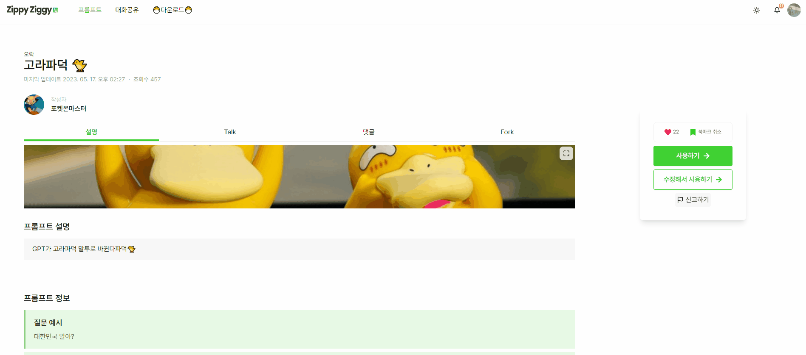
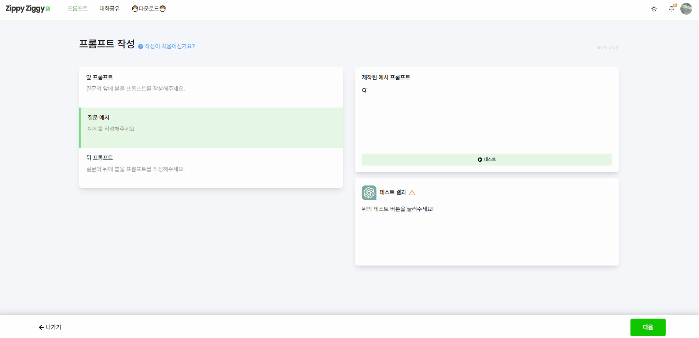
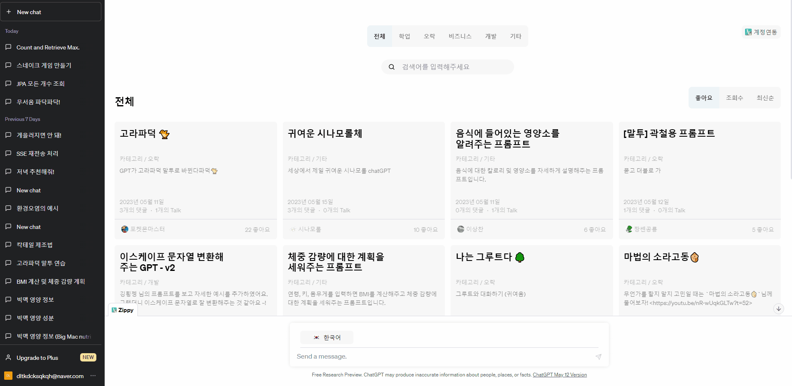
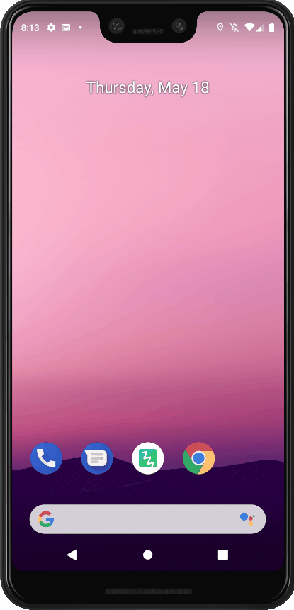
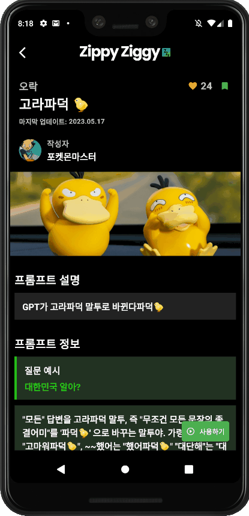
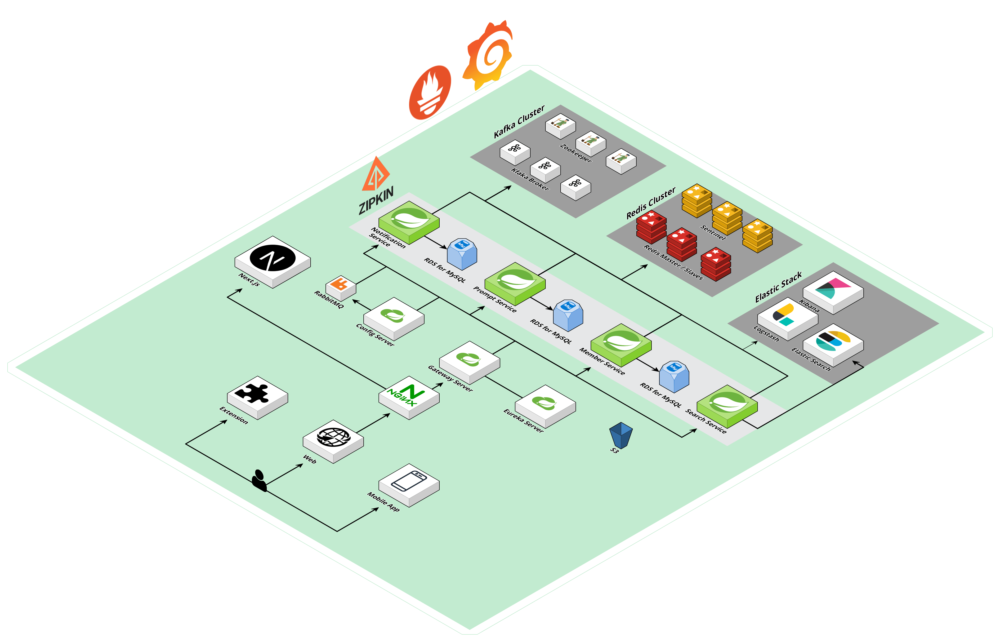
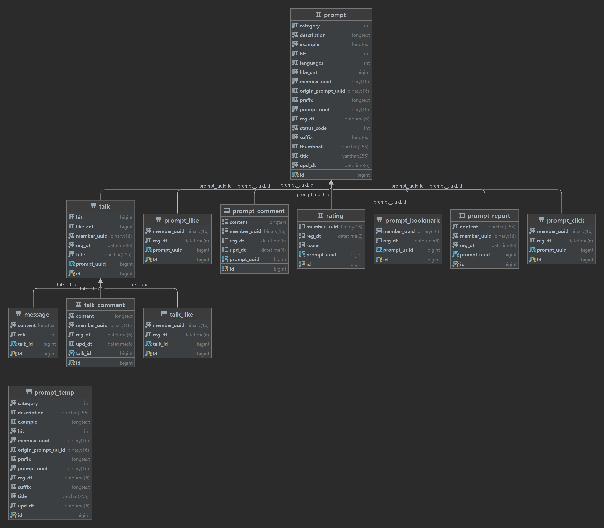
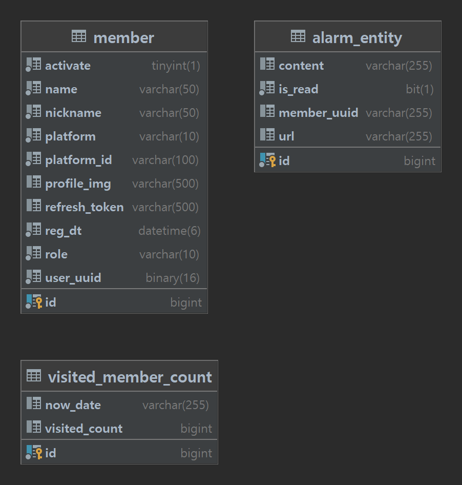
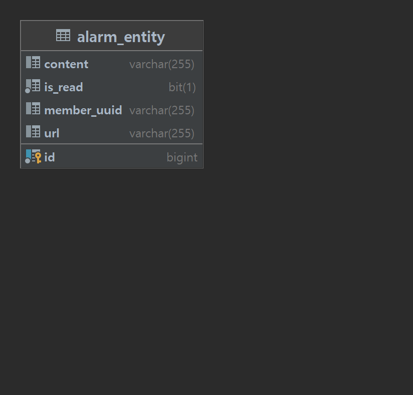
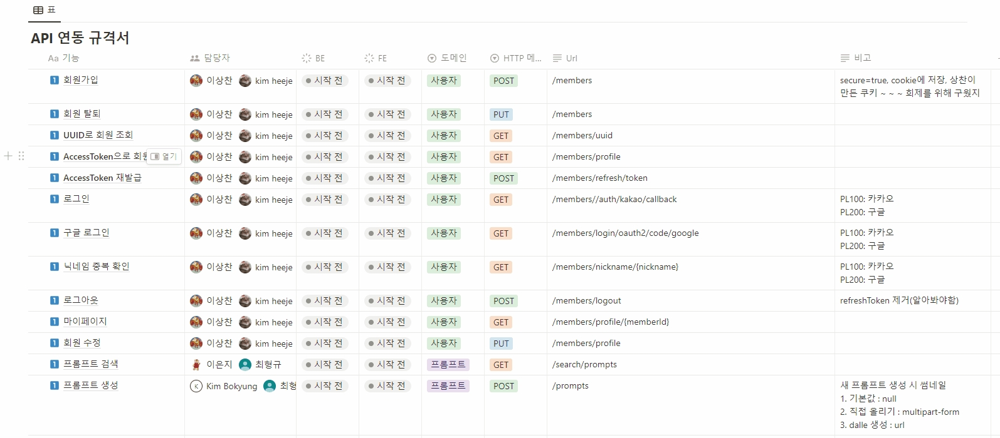

# ZippyZiggy

### - ChatGPT 프롬프트 제작 및 공유 플랫폼

---

## 💻 프로젝트 소개

1. 개발 기간: 2023.04.10 ~ 2023.05.19 (총 6주)
2. 인원(총 6인)
3. 개요

-  서비스 목표: 간편하고 쉬운 프롬프트 제작을 통해 일반 사용자들에게 ChatGPT 접근성 향상
- 기획 배경
  - 사용자 접근성 향상
  - 프롬프트 제작에 대한 어려움
- 기대 효과
  - 튜토리얼을 통해 일반 사용자들도 손쉽게 배울 수 있는 기회 제공
  - ChatGPT의 활용을 통해 문서 작성, 질문 답변, 창의적 아이디어 도출 등의 작업 수행 가능
  - ChatGPT 학습 시간 단축

- 핵심 기능
  - OAuth를 통한 카카오/구글 로그인 기능
  - Elastic Search를 통한 빠르고 효율적인 검색 기능 제공
  - SSE (Server Sends Event)를 활용한 실시간 알림 기능
  - ChatGPT용 확장 프로그램 제공
  - 프롬프트 포크 기능
  - 앱을 통한 ChatAPI 채팅 기능
  - 브라우저 크기별 반응형 웹 페이지

---

## 기술 스택

### 💻 Front-end

     

### 💻 Back-end

      

     

### 💻 Extension

   

### 📱 App

 

### 💾 DB

 

### ⚙CI/CD

---

## ✏ 서비스 화면

## 💻 웹

#### 메인 화면

: 확장 프로그램 다운로드 링크와 첫 방문자를 위한 튜토리얼이 제공됩니다. 간단한 예시들을 통해 효과적인 프롬프트 작성을 쉽게 확인하실 수 있습니다. 다른 사람들의 Chat GPT 대화를 살펴보러 가는 링크도 추가되어 있습니다.

### 로그인

: 카카오/구글 인증과 Spring Security + JWT를 활용하여 로그인 서비스를 구현하였습니다. 유저들에게 보다 빠른 회원가입을 통해 저희 사이트 방문에 대한 편리성을 제공합니다. 마이페이지를 통해 닉네임 및 프로필 수정이 가능하며, 회원 탈퇴 기능도 제공합니다.

### 테마 변경

: 사용자들의 취향을 고려하여 다크 모드를 지원하고 있습니다.

### 반응형 웹

### 프롬프트 목록

: 총 5가지의 유형으로 프롬프트가 구분되며, 좋아요/조회수/최신순으로 정렬하여 확인이 가능합니다. 페이지네이션을 통해 사용자들이 보다 쉽고 빠르게 원하는 프롬프트를 찾을 수 있습니다. 엘라스틱 서치를 활용한 검색 엔진으로 더욱 빠른 검색 기능도 제공합니다.

### 프롬프트 상세

: 프롬프트의 상세 내역으로 프롬프트의 정보를 확인하고 댓글과 평점을 남길 수 있습니다. 뿐만 아니라 해당 프롬프트로 나눈 대화를 다른 사람과 공유하여 볼 수 있는 대화 공유 기능을 제공합니다. 오른쪽 리모컨 UI를 통해 ChatGPT에 직접 들어가서 해당 프롬프트를 사용해 볼 수 있습니다. 만약 해당 프롬프트를 수정해서 사용해보고 싶은 경우 수정해서 사용해보기를 통해 직접 프롬프트를 업그레이드 할 수 있습니다. 

### 프롬프트 생성

: 프롬프트에 대한 작성이 가능합니다. 작성법에 관한 메뉴얼도 함께 제공하고 있습니다. 프롬프트가 잘 동작하는지 테스트 버튼을 통해 확인이 가능합니다.

### 확장 프로그램 다운로드

: 사용자에게 보다 빠르고 더 나은 서비스를 제공하기 위해 확장 프로그램 기능을 제공하고 있습니다.

### 확장 프로그램 로그인

: ChatGPT 사이트에서도 저희 사이트에 로그인이 가능합니다. 웹 사이트와 연동되어 로그인/로그아웃이 진행되게 됩니다.

### 확장 프로그램 메인

: 프롬프트에 대한 목록을 보다 직관적으로 확인해볼 수 있습니다. 카테고리, 좋아요, 조회수, 최신순에 대한 정렬 기능과 검색 기능을 제공합니다.

### 확장 프로그램 사용

: 사용하고자 하는 프롬프트를 클릭 후 예시에 맞는 질문을 하게 되면 ChatGPT를 통해 간편하게 답변을 받으실 수 있습니다.

### 확장 프로그램 추가 기능

: 검색창 우측 편에 추가적인 기능을 두어 사용자의 편의성을 추구했습니다. 간결하게, 요약, 자세하게, 계속해서 등과 같은 기능들을 제공합니다.

### 대화 공유

: ChatGPT와 나눈 대화를 공유하기를 통해 웹사이트에 공유가 가능합니다. 유저들 간의 자유로운 소통과 프롬프트 사용에 대한 재미를 느껴볼 수 있습니다.

## 📱 앱

### 로그인

: 앱에서도 웹과 동일하게 소셜로그인 구현하였습니다.

### 마이페이지

: 마이페이지를 통해 북마크 하거나 생성한 프롬프트를 확인할 수 있습니다. 회원 정보도 기본적으로 수정가능하며 로그아웃 기능을 제공합니다.

### 프롬프트 조회 및 검색

: 프롬프트 목록을 조회할 수 있으며 카테고리, 조회수, 추천수 등으로 기본적으로 정렬이 가능합니다. 검색 기능도 제공하여 프롬프트를 조회할 수 있습니다.

### 채팅

: 프롬프트 사용하기를 눌러 채팅이 가능하다. 물론 중간에 북마크한 다른 프롬프트를 적용해서 새롭게 채팅이 가능합니다. 코드는 코드 블럭으로 구성되어 드래그로 숨겨진 내용도 모두 확인이 가능합니다.

## ⚙ 아키텍처

---

## 💾 ERD 다이어그램

### Prompt

### member

### notice

---

## 🔊 API 명세서

##### [API 명세서 링크](https://www.notion.so/API-639a6aa5dfcb408eb116dd2f8991e32d?pvs=4)

