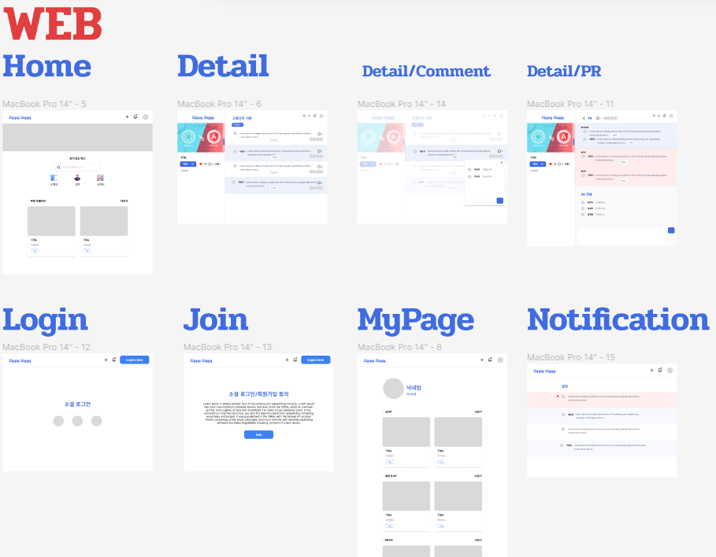
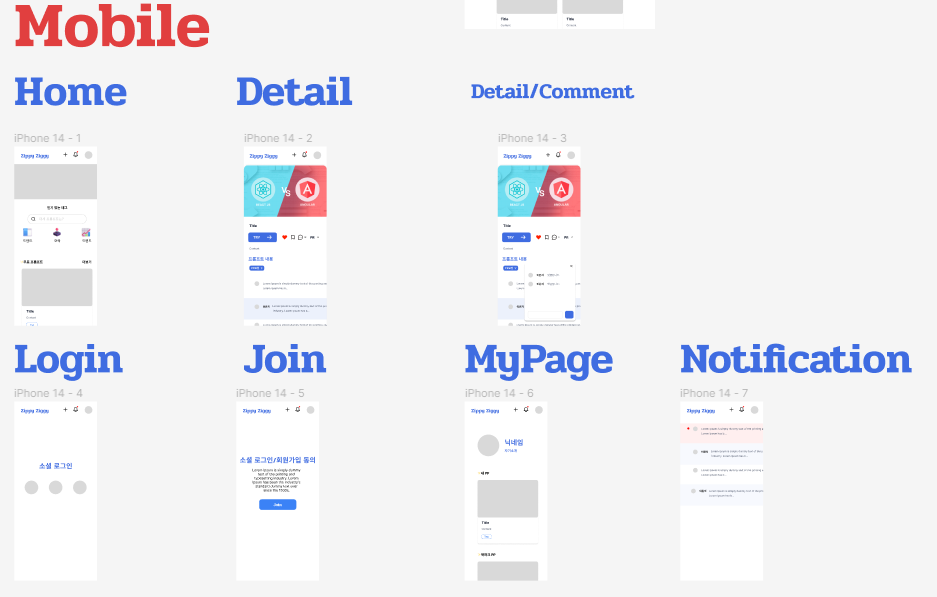
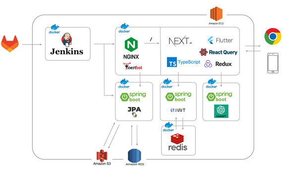

## 📢 프로젝트 이름: Zippy Ziggy

## 💻 프로젝트 소개

Zippy Ziggy는 나의 Chat GPT 프롬프트 자랑하기 서비스입니다. 사용자는 원하는 방식으로 학습시킨 Chat GPT 모델을 공유할 수 있습니다. 또, 다른 사람이 학습시킨 프롬프트를 이용할 수 있습니다. 웹, 앱, 크롬 확장 프로그램 등 여러 플랫폼에서 서비스를 제공하고, 사용하기 쉽게 만들어 일반 사용자의 접근성을 높이고자 합니다.

## 👨‍👩‍👦‍👦  팀원소개

| NAME   | ROLE                               |
| ------ | ---------------------------------- |
| 이상찬 | 백엔드, 서버 배포                  |
| 김보경 | 백엔드, CI/CD 구축                 |
| 이은지 | 백엔드, Elastic Search 구현        |
| 김희제 | 사용자  이벤트 추적 및 분석        |
| 김창준 | 웹  개발 환경 구성, 크롬 확장 개발 |
| 최형규 | 앱  개발 환경 구성                 |

## 📌 Ground Rule

## 목표 🥅

- 4주 개발 + 2주 운영
- 운영 중 로그 수집 → 개선
- 화목하게 지내기
- 취업에 도움이 되는 프로젝트를 하자!
- `프론트 테스트` 해보고 싶은데 뭐 어떻게 해야될 지 모르겠다.
- `프론트` log남기기

------

## 팀 문화 🏠

#### 1. 출근 / 퇴근 미팅

- 출근: 바로
- 퇴근: 5시 반

#### 2. 초반 머지는 리뷰 꼭 받기

- 코드 리뷰

#### 3. 컨벤션 지키기

- Git convention

#### 4. 공유는 생명

#### 5. 지각하면 커피 사기

---

## ⌨ 와이어 프레임

Figma 사이트: https://www.figma.com/file/HduIr84qMUsibOfiwKlAOo/%EC%A7%80%ED%94%BC%EC%A7%80%EA%B8%B0?node-id=0-1

---

## 아키텍쳐 초안

